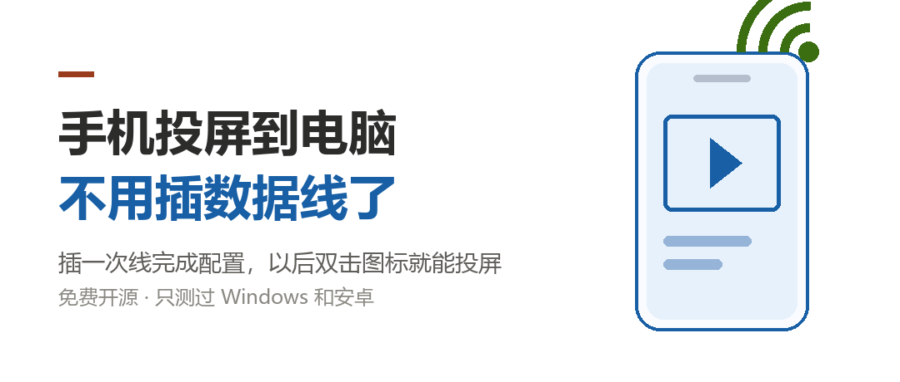
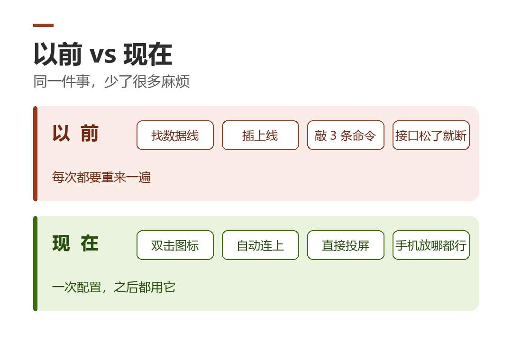
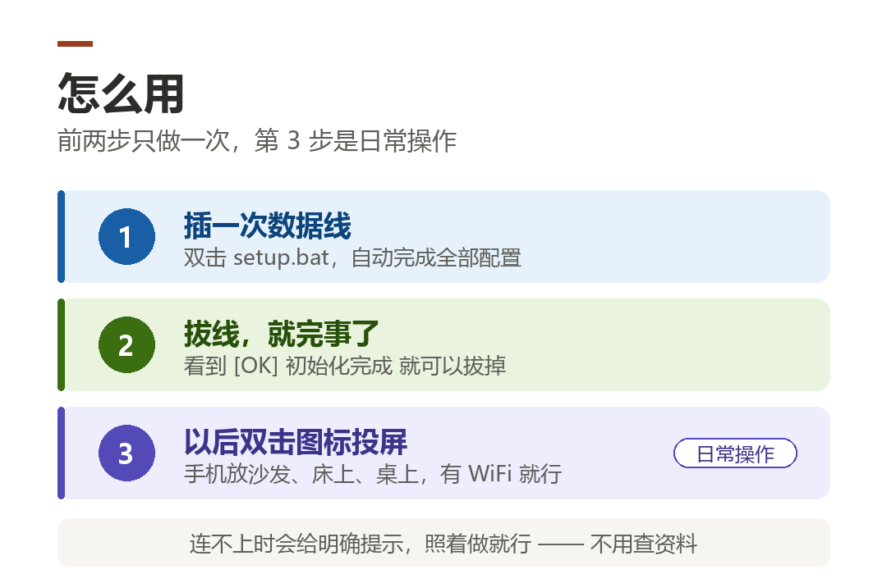

# 手机投屏到电脑，终于不用插数据线了

> **配图 1：封面图**
> 

每次想把手机画面投到电脑上，是不是都要找根数据线？

找到了还好说，最烦的是——**线在客厅，人在书房**；或者线插上了，接口松，动一下就断。

我做了个小工具，把这件事变简单了。

---

## 用它之前 vs 用它之后

> **配图 2：对比图**
> 

| | 以前 | 现在 |
|---|---|---|
| 连接方式 | 每次都要插数据线 | 无线，手机放哪都行 |
| 操作步骤 | 敲 3 条命令 | 双击一个图标 |
| 手机重启后 | 重新查教程 | 跑一次脚本自动恢复 |
| 连不上时 | 一堆报错看不懂 | 直接告诉你「IP 变了」 |

---

## 怎么用

> **配图 3：流程图**
> 

**第一步：插一次线**（就这一次）

用数据线连上电脑，双击 `setup.bat`，它自动做完所有配置。

看到 `[OK] 初始化完成！` 就可以**把线拔了**。

**第二步：以后双击就投屏**

电脑桌面上会有一个「手机无线投屏」的图标，双击即可。

手机放在沙发、床上、桌上都行，只要有 WiFi。

---

## 连不上也没关系

这点我觉得比功能本身更重要。

一般的工具连不上，就丢给你一句 `unable to connect`，然后你自己猜。

这个工具会直接说清楚问题出在哪：

```
[X] 手机 192.168.1.100 没有响应

可能原因：
  1. 手机和电脑不在同一个 WiFi
  2. 手机 IP 变了（路由器重启 / 换网络）
  3. 手机 WiFi 断了或进入了睡眠

怎么办：
  - 确认手机连着和电脑相同的 WiFi
  - 查看手机 IP：设置 - WLAN - 当前网络详情
  - 或插数据线双击 setup.bat 重新初始化
```

不用查资料，照着做就行。

---

## 一些说明

- **完全免费、开源**，代码在 GitHub 上，随时可以自己看
- 用的是 scrcpy 官方的组件，没有任何修改版
- 只在**可信网络**（家里、办公室）用，别在公共 WiFi 下开着
- 目前**只测试过 Windows 和安卓**，Mac 和 Linux 的脚本写了但没验证过

---

## 下载

**https://github.com/Wcai018/scrcpy-wireless-launcher**

需要先装一个叫 [scrcpy](https://github.com/Genymobile/scrcpy/releases) 的软件（免费开源，解压就能用），
然后把这个小工具放在一起就行。仓库里有详细步骤。

有电脑基础的话，五分钟能搞定。

---

> 如果觉得有用，帮忙在 GitHub 上点个 ⭐
> 或者在评论区告诉我你用的手机型号，我看看能不能适配得更好。
>
> 特别是用 Mac 的朋友——脚本我写了，但自己没环境测试，
> 你如果试了，不管成功失败都欢迎反馈。
